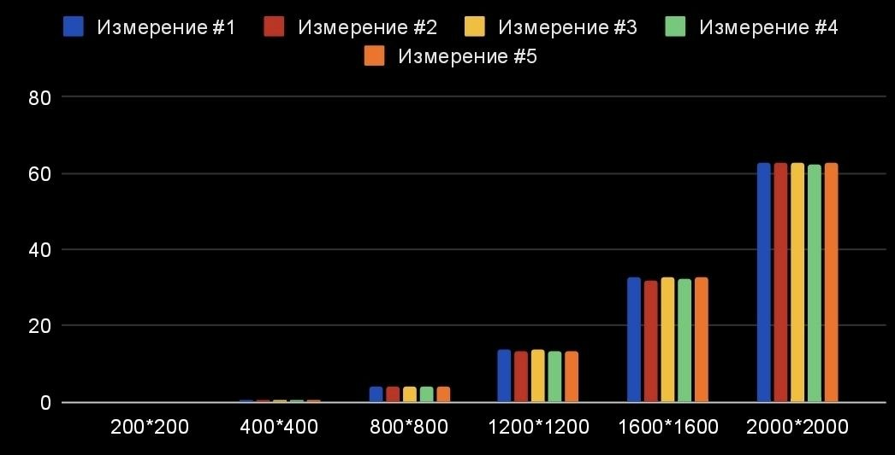

# Цель работы

Получить данные о производительности последовательного алгоритма умножения квадратных матриц для последующего сравнения с параллельными реализациями.
# Задачи

* Написать программу для создания исходных матриц и записи их в файл
* Написать программу на языке C/C++ для перемножения двух квадратных матриц
* Написать скрипт для проверки вычислений на Python
* Сделать отчет о проделанной работе
# Ход работы

## Создание исходных файлов

Создаем исходные файлы, для дальнейшей работы и пишем код для создания случайных элементов матрицы.

Создаем вектор целых чисел и заполняем его случайными числами, создав генератор случайных целых чисел от 1 до 100.

``` C++
std::vector<int> vector_for_using(n * n);

    std::random_device rd;
    std::mt19937 gen(rd());
    std::uniform_int_distribution<> dis(1, 100);

    for (std::size_t i = 0; i < vector_for_using.size(); ++i)
    {
        vector_for_using[i] = dis(gen);
    }
```

После чего открываем файл на перезапись и сохраняем весь вектор в него.

```C++
std::ofstream file(full_path);

    if (!file)
    {
        throw std::logic_error("Файл не открылся");
    }

    for (int i = 0; i < n; ++i)
    {
        for (int j = 0; j < n; ++j)
        {
            std::print(file, "{:4}", vector_for_using[i * n + j]);
        }
        std::println(file, "");
    }
```

## Основная программа на С++ для умножения матриц

Загружаем матрицу в вектор из файла.

```C++
void VectorLoading(std::vector<int> &vec, const std::string &text)
{
    int number = 0;

    std::ifstream file(text);

    if (!file.is_open())
    {
        throw std::logic_error("Error open file");
    }

    while (file >> number)
    {
        vec.push_back(number);
    }
}
```

Поскольку std::vector одномерен и двумерную матрицу туда можно записать только построчно, то понадобится формула для умножения матриц в одномерном представлении. Далее представлена такая функция.

```C++
void productMatrix(const std::vector<int> &multiplier_one,
                   const std::vector<int> &multiplier_two,
                   std::vector<long long> &result,
                   std::size_t size)
{
    result.resize(size * size);
    std::fill(result.begin(), result.end(), 0);

    for (std::size_t i = 0; i < size; ++i)
    {
        for (std::size_t k = 0; k < size; ++k)
        {
            long long a_ik = multiplier_one[i * size + k];

            for (std::size_t j = 0; j < size; ++j)
            {
                result[i * size + j] += a_ik * multiplier_two[k * size + j];
            }
        }
    }
}
```

Загружаем результирующий вектор в конечный файл.

```C++
void WriteResult(const std::vector<long long> &result, std::string_view filename, std::size_t size, const auto &time)
{
    std::string full_path = "../../../labs/matrices/result/" + std::string(filename);
    std::ofstream file(full_path);

    if (!file)
    {
        throw std::logic_error("Файл не открылся");
    }

    std::print(file, "Время выполнения: {}", time);
    std::println(file, "");
    std::print(file, "Количество элементов матрицы: {}", size * size);
    std::println(file, "\n");

    for (std::size_t i = 0; i < size; ++i)
    {
        for (std::size_t j = 0; j < size; ++j)
        {
            std::print(file, "{:12}", result[i * size + j]);
        }
        std::println(file, "");
    }

    std::println("Матрица успешно записана в файл {}", filename);
}
```

## Проверка результата на Python

Для подтверждения правильности работы алгоритма была использована автоматизированная система верификации на языке Python с библиотекой NumPy. Скрипт сравнивал результаты, полученные C++ программой, с эталонным произведением матриц, вычисленным средствами NumPy.

```Python
import numpy as np

import sys

  

sizes = [200, 400, 800, 1200, 1600, 2000]

  

for n in sizes:

try:

a = np.loadtxt(f"../../matrices/data/m{n}_1.txt", dtype=np.int64, comments='#')

b = np.loadtxt(f"../../matrices/data/m{n}_2.txt", dtype=np.int64, comments='#')

c = np.loadtxt(f"../../matrices/result/result{n}.txt", dtype=np.int64, comments='#')

  

if np.array_equal(a @ b, c):

print(f"[{n}x{n}] OK")

else:

print(f"[{n}x{n}] FAIL")

except FileNotFoundError:

print(f"[{n}x{n}] skip (no files)")
```

## Результаты измерений производительности

Эксперимент проводился на последовательной реализации алгоритма умножения матриц. Для каждого размера матрицы $N*N$ было проведено 5 замеров времени выполнения. Результаты представлены в таблице 1.

| Размер матрицы $(N*N)$ | Измерение #1 | Измерение #2 | Измерение #3 | Измерение #4 | Измерение #5 | **Среднее время** |
| ---------------------- | ------------ | ------------ | ------------ | ------------ | ------------ | ----------------- |
| **200 × 200**          | 0,0627       | 0,0626       | 0,0637       | 0,0631       | 0,0627       | **0,0630 с**      |
| **400 × 400**          | 0,4957       | 0,4965       | 0,4993       | 0,4951       | 0,4973       | **0,4957 с**      |
| **800 × 800**          | 4,0364       | 4,0358       | 4,0567       | 4,0805       | 4,0134       | **4,0446 с**      |
| **1200 × 1200**        | 13,5260      | 13,4018      | 13,6789      | 13,2349      | 13,4468      | **13,4577 с**     |
| **1600 × 1600**        | 32,5993      | 32,0518      | 32,7652      | 32,1836      | 32,6548      | **32,4510 с**     |
| **2000 × 2000**        | 62,7861      | 62,9520      | 62,8936      | 62,3417      | 62,9475      | **62,7842 с**     |

Таблица 1. Время выполнения умножения матриц (в секундах)

Рис. 1. Экспериментальная зависимость времени выполнения от размера матрицы

**Анализ результатов:** Как видно из таблицы и графика, зависимость времени выполнения от размера матрицы носит ярко выраженный нелинейный характер.

- При увеличении размера матрицы в 2 раза (например, с 200 до 400), время выполнения возрастает примерно в 8 раз.
- При увеличении размера в 10 раз (с 200 до 2000), время возрастает примерно в 1000 раз.

Это полностью подтверждает теоретическую оценку трудоемкости алгоритма $O(N^3)$. 

# Вывод

В ходе лабораторной работы был реализован и исследован последовательный алгоритм умножения квадратных матриц.

1. Подтверждена сложность $O(N^3)$. Экспериментальные данные показывают, что при увеличении линейного размера матрицы N в k раз, время выполнения увеличивается в $k^3$ раз.
2. Установлено, что для матрицы $2000×2000$ последовательному алгоритму требуется около 63 секунд. Это значение будет использоваться как точка отсчета для оценки эффективности параллельных реализаций в следующих работах.
3. Корректность доказана. Автоматизированная верификация подтвердила полное совпадение результатов с эталонной библиотекой NumPy.