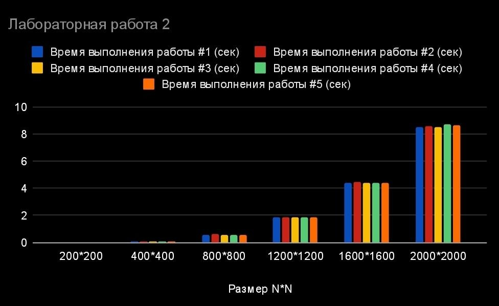
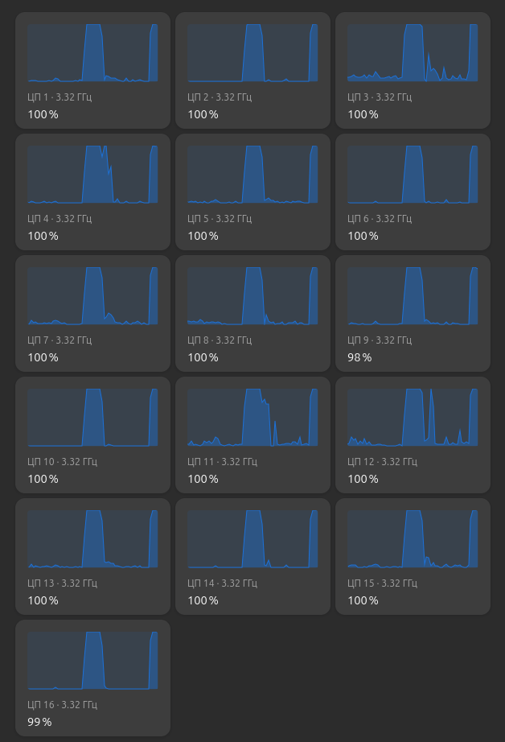

# Лабораторная работа №2: Распараллеливание с OpenMP

## Цель работы

Реализовать параллельную версию алгоритма умножения квадратных матриц с использованием стандарта OpenMP и оценить эффективность распараллеливания по сравнению с последовательной версией.

## Задачи

- Добавить директивы OpenMP к последовательному алгоритму умножения матриц
- Провести серию измерений времени выполнения для различных размеров матриц
- Рассчитать ускорение параллельной версии относительно последовательной
- Проанализировать эффективность использования ресурсов процессора

## Ход работы

### Добавление OpenMP

Подключаем заголовочный файл OpenMP

```C++
#include <omp.h>
```

Добавляем директиву OpenMP непосредственно перед циклом, который нужно распараллелить:

```cpp
#pragma omp parallel for
for (std::size_t i = 0; i < size; ++i)
{
    for (std::size_t k = 0; k < size; ++k)
    {
        long long a_ik = multiplier_one[i * size + k];

        for (std::size_t j = 0; j < size; ++j)
        {
            result[i * size + j] += a_ik * multiplier_two[k * size + j];
        }
    }
}
```

Добавляем поддержку OpenMP в корневой CMakeLists
```CMakeLists
find_package(OpenMP REQUIRED)
```

Во внутреннем CMakeLists добавляем:

```CMakeLists
target_link_libraries(lab2 PRIVATE OpenMP::OpenMP_CXX)
```

### Измерения

Эксперимент проводился с использованием стандарта OpenMP. Для каждого размера матрицы $N × N$ было проведено 5 замеров времени выполнения. Результаты представлены в таблице 1.

| Размер N×N    | Замер #1 (с) | Замер #2 (с) | Замер #3 (с) | Замер #4 (с) | Замер #5 (с) | **Среднее (с)** |
| :------------ | :----------- | :----------- | :----------- | :----------- | :----------- | :-------------- |
| **200×200**   | 0,0178       | 0,0217       | 0,0234       | 0,0157       | 0,0157       | **0,0189**      |
| **400×400**   | 0,0697       | 0,0701       | 0,0697       | 0,0715       | 0,0692       | **0,0700**      |
| **800×800**   | 0,5486       | 0,5940       | 0,5637       | 0,5457       | 0,5480       | **0,5600**      |
| **1200×1200** | 1,8529       | 1,8580       | 1,8516       | 1,8476       | 1,8539       | **1,8528**      |
| **1600×1600** | 4,3940       | 4,4365       | 4,3702       | 4,3736       | 4,4287       | **4,4006**      |
| **2000×2000** | 8,5387       | 8,5575       | 8,5483       | 8,7380       | 8,6343       | **8,6034**      |

Таблица 1. Время выполнения умножения матриц (в секундах)


Рис. 1. Экспериментальная зависимость времени выполнения от размера матрицы



Рис. 2. Загрузка логических ядер процессора во время выполнения программы


### Сравнение с последовательной версией (Lab 1) и расчет ускорения

Для оценки эффективности распараллеливания рассчитаем коэффициент ускорения по формуле: $S = T_{seq} / T_{par}$, где $T_{seq}$ — среднее время из Лабораторной работы №1, а $T_{par}$ — среднее время из текущей работы.

| Размер N×N | Lab 1 (с) | Lab 2 (с) | **Ускорение (×)** |
|:-----------|:----------|:----------|:------------------|
| 200×200    | 0,0630    | 0,0189    | **3,33**          |
| 400×400    | 0,4957    | 0,0700    | **7,08**          |
| 800×800    | 4,0446    | 0,5600    | **7,22**          |
| 1200×1200  | 13,4577   | 1,8528    | **7,26**          |
| 1600×1600  | 32,4510   | 4,4006    | **7,37**          |
| 2000×2000  | 62,7842   | 8,6034    | **7,30**          |

### Анализ результатов

1. **Значительное сокращение времени:** Для матрицы 2000×2000 время выполнения сократилось с ~62,8 секунд до ~8,6 секунд.

2. **Зависимость ускорения от размера задачи:**
   - Для малых матриц (200×200) ускорение составляет всего **3,33×**. Это связано с тем, что накладные расходы на создание и синхронизацию потоков OpenMP сопоставимы с самим временем вычислений.
   - Начиная с размера 400×400, ускорение быстро растет и стабилизируется на уровне **~7,3×**.

3. **Почему ускорение не равно количеству логических ядер (16)?**
   - **Hyper-Threading:** из 16 логических ядер только 8 физических. Hyper-Threading дает прирост ~20-30%, но не удваивает производительность.
   - **Ограничения памяти:** все потоки одновременно обращаются к RAM, создавая узкое "горлышко".

## Выводы

1. Использование OpenMP позволило достичь ускорения **~7,3×** для больших матриц.
2. Параллелизация эффективна начиная с размера матрицы 400×400. Для меньших размеров накладные расходы потоков нивелируют выгоду.
3. График загрузки процессора подтверждает, что OpenMP корректно распределяет нагрузку на все доступные логические ядра.
4. Ограничения ускорения (~7,3× вместо теоретических 16×) объясняются Hyper-Threading, ограничениями пропускной способности памяти.
5. Корректность параллельной версии подтверждена скриптом верификации на Python — результаты полностью совпадают с последовательной версией.
